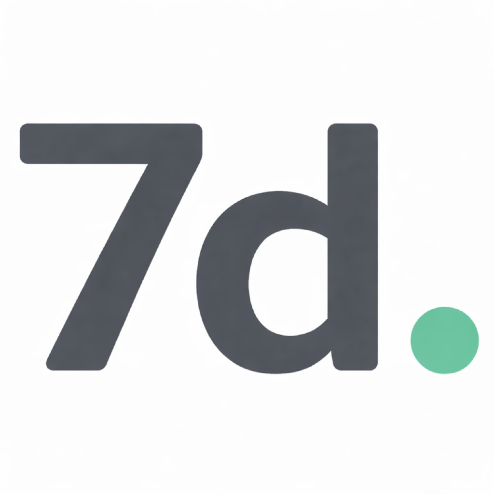

<p align="center">
  
</p>

<h1 align="center">7day</h1>

<p align="center">
  Minimalist iOS weight tracking app — weekly averages over daily noise.
</p>

<p align="center">
  <code>iOS 17+</code> · <code>SwiftUI</code> · <code>SwiftData</code> · <code>Swift Charts</code> · <code>Zero Dependencies</code>
</p>

---

## What It Is

Daily weigh-ins are noisy — water, sodium, sleep, and timing can swing your weight 2-3 lbs day to day. **The weekly average is your real weight.** 7day groups weigh-ins into Monday–Sunday weeks and shows the trend that actually matters.

Open the app, log your weight in under 3 seconds, close it. That's 90% of usage.

## Features

- **Fast weight logging** — large monospaced input, auto-focused, one tap to save
- **Weekly averages** — automatic Mon–Sun grouping with trend comparison
- **Progress charts** — Swift Charts line + area chart with dashed goal overlays
- **Block planning** — define cut / bulk / maintain cycles with rate-based weekly targets
- **CSV import & export** — paste or pick a file, share backups
- **No third-party dependencies** — pure Apple frameworks

## Tech Stack

| | |
|---|---|
| **Language** | Swift 6 |
| **UI** | SwiftUI |
| **Persistence** | SwiftData (on-device) |
| **Charts** | Swift Charts |
| **Architecture** | `@Observable` view model pattern |
| **Target** | iOS 17+, iPhone |

## Project Structure

```
7day/
├── _dayApp.swift              # App entry point, SwiftData container
├── Models/
│   ├── WeightEntry.swift      # One-per-day weight record
│   └── Block.swift            # Cut/bulk/maintain cycle
├── ViewModels/
│   └── WeightViewModel.swift  # Business logic & computed properties
├── Views/
│   ├── ContentView.swift      # TabView container
│   ├── SplashView.swift       # Launch animation
│   ├── LogTab/                # Weight input + weekly summary
│   ├── ProgressTab/           # Charts + week-by-week list
│   ├── PlanTab/               # Block creation & management
│   └── ImportTab/             # CSV import/export + data tools
├── Theme/
│   └── Theme.swift            # Colors, fonts, shared modifiers
├── Utilities/
│   └── DateHelpers.swift      # ISO week calculations, formatting
└── Fonts/                     # IBM Plex Mono
```

## Getting Started

**Requirements:** Xcode 16+, iOS 17+ simulator or device

```bash
git clone https://github.com/7day-app/7day.git
cd 7day
open 7day.xcodeproj
```

Build and run. No CocoaPods, no SPM packages, nothing to install.

## License

[MIT](LICENSE)
